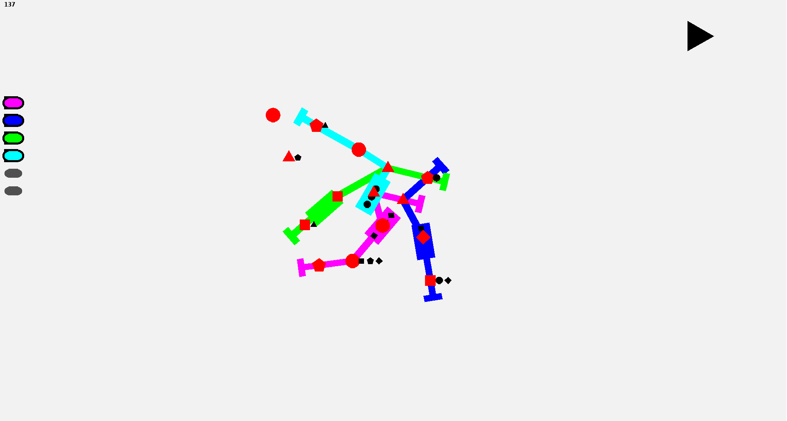

<h1>Mini Underground</h1>

Mini Underground is a remake of the popular game <a
	href="http://old.dinopoloclub.com/minimetro/">Mini Metro</a>.
You start with a few stations. It is your task to make the routes the
trains must follow. You have to make sure that stations don't get
overcrowded. The game has been designed for GNU/Linux and Android, but it probably won't be so hard to port it to Windows and MAC OS. The program is written in C++ using the <a href="https://www.libsdl.org/">SDL</a> library.

You can get the source code from my <a href="https://github.com/tvmaaren/mini-underground">github</a>.
<h2>Screenshots</h2>

Click on the images to view them.

<h2>Dependencies</h2>

The dependencies are <a href="https://github.com/libsdl-org/SDL">SDL</a>,<a href="https://github.com/libsdl-org/SDL_ttf">SDL_ttf</a> and <a href="https://github.com/ferzkopp/SDL_gfx">SDL_gfx</a>.

<h2>Compilation</h2>

For GNU/Linux go to the directory you extracted the source to and run:

<i>make</i>

After this the file <i>main</i> should appear. To play the game run:

<i>./main</i>

<h2>Gameplay</h2>

In the beginning you will see four shapes on the map. These shapes
represent stations. At some point small black shapes will appear next
to the station. These are the passengers that are waiting at the
station and there shape represents the station they want to go to. By
pressing on then by sliding to another station you can create train
lines connecting the stations. When you have created a line a train will
appear on that line that will bring passengers to their stations. The
game ends when there are more than 10 passengers at a station.
